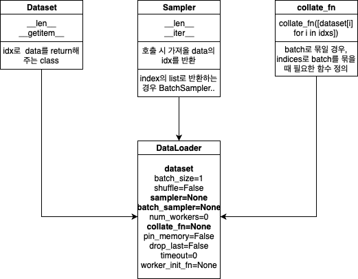
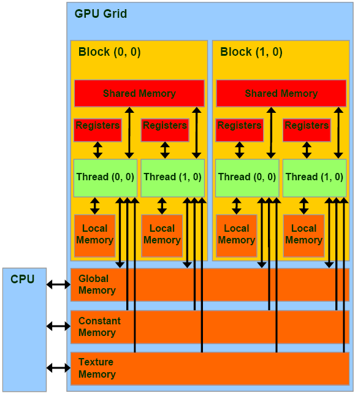

# Week 2 : Pytorch

## Contents 
- Pytorch의 기본과 관련된 질문을 스스로에게 해보고 답해보자.
    1. 나는 torch.Tensor.view와 torch.Tensor.reshape의 차이와 그런 차이가 갖는 의미를 설명할 수 있는가?
    2. 나는 Dataloader함수의 각 parameter들의 역할을 제대로 설명할 수 있는가?
    3. 왜 Pytorch에선 x = x + 1을 x += 1과 같은 형태로 쓰지 않을까? 
- Pytorch Trouble shooting의 내용들을 정리하자.
---
## 1. 나는 torch.Tensor.view와 torch.Tensor.reshape의 차이와 그런 차이가 갖는 의미를 설명할 수 있는가?
- 내가 pytorch를 몇 년 쓰면서 이 질문을 대답 못하겠더라.. 참내~
- 강의에서 torch.Tensor.view와 torch.Tensor.reshape의 가장 큰 차이는 "Contiguity 보장 여부" 라는데 이 말이 무슨 뜻인지 찾아보았다.

    > 매모리 상에서 tensor의 요소들이 저장되어 있는 주소가 순차적으로 이어져 있는 경우, 이를 contiguous한 상태라고 한다.

- 예시를 들어보면,
    ``` python
    # is_contiguous는 x가 메모리에 contiguous하게 저장되어 있는지를 Boolean으로 반환해준다.
    a = torch.tensor([[1,2,3],[4,5,6]])
    print(a) 
    print(a.is_contiguous())
    # tensor([[1, 2, 3],[4, 5, 6]]) , True
    a = a.transpose(0,1)
    print(a)
    print(a.is_contiguous())
    # tensor([[1, 4],[2, 5],[3, 6]]), False
    a = a.contiguous()
    print(a)
    print(a.is_contiguous())
    # tensor([[1, 4],[2, 5],[3, 6]]), True
    ```
    위 코드에서 볼 수 있듯이, a가 transpose되는 순간 원소 4는 tensor상에서 2번째에 위치하게 되는데 실제로 a가 선언될 때 메모리 상에서는 4번째에 위치하고 있고 is_contiguous()가 False를 뱉는다. 추가로, contiguous()를 통해 tensor를 contiguous하게 바꿀 수 있다.
- 궁금하니까 실제로 그런지 확인해보자.
    ``` python
    a = torch.tensor([[1,2,3],[4,5,6]])
    b = a.t()
    for i in range(2):
        for j in range(3):
            print(a[i][j].data_ptr())
    94066690072064
    94066690072072
    94066690072080
    94066690072088
    94066690072096
    94066690072104 # 32bit float, 8 byte씩 증가
    for i in range(3):
        for j in range(2):
            print(b[i][j].data_ptr())
    94066690072064 1
    94066690072088 4
    94066690072072 2 
    94066690072096 5
    94066690072080 3 
    94066690072104 6
    b = b.contiguous()
    for i in range(3):
        for j in range(2):
            print(b[i][j].data_ptr())
    94395224670592
    94395224670600
    94395224670608
    94395224670616
    94395224670624
    94395224670632 # 8 byte씩 증가 하도록 align된 모습
    ```
    - 주소 값을 뽑아봄으로써 알게 된 한가지 사실은, contiguous()가 적용될 때엔 기존에 사용되던 메모리 공간이 아닌 새로운 주소에 값들을 정렬하여 할당한다는 것이다.
    - 그럼 기존 주소에 있는 값들은 남아있을까?
        ``` python
        import ctypes
        print(ctypes.cast(id(a), ctypes.py_object).value)
        # tensor([[1,2,3],[4,5,6]]) 남아있다.
        ```
    - **즉, contiguous()가 적용될 때엔 다른 메모리 주소로의 복사가 일어나는 것이다.**

- 다시 돌아와서, 강의자료의 torch.Tensor.view()와 torch.Tensor.reshape()의 차이를 나타내주는 코드를 살펴보자.
    ``` python
    a = torch.zeros(3,2)
    b = a.view(2,3)
    a.fill_(1)
    print(a,b) # [[1,1],[1,1],[1,1]], [[1,1,1],[1,1,1]]
    a = torch.zeros(3,2)
    b = a.t().reshape(6)
    a.fill_(1)
    print(a,b) # [[1,1],[1,1],[1,1]], [0,0,0,0,0,0]
    ```
    - view를 사용하여 변환된 tensor는 기존 텐서의 변경사항이 적용 되고, reshape을 사용한 경우엔 적용이 안되는 것을 알 수 있다.
    - 메모리 주소를 뽑아보면,
        ``` python
        a = torch.zeros(3,2)
        b = a.view(2,3)
        a.fill_(1)
        print(a,b) # [[1,1],[1,1],[1,1]], [[1,1,1],[1,1,1]]
        for i in range(3):
            for j in range(2):
                print(a[i][j].data_ptr())
        94252172893760
        94252172893764
        94252172893768
        94252172893772
        94252172893776
        94252172893780
        for i in range(2):
            for j in range(3):
                print(b[i][j].data_ptr())
        94252172893760
        94252172893764
        94252172893768
        94252172893772
        94252172893776
        94252172893780
        ```
    - a 와 b가 같은 tensor index의 element에 대해 동일한 메모리 공간을 쓰는 것을 알 수 있다. 
    - **즉 , view는 transpose후에도 기존에 사용하던 메모리 공간에 contiguous하게 element들이 저장되도록 해준다는 것이다.**
    - 그렇기 때문에, a가 할당된 메모리 주소에 1을 채워도 결국 b와 주소를 공유하기 때문에 b 또한 바뀌게 되는 것이다. 마찬가지로 b.fill_(1)을 해도 a가 함께 바뀐다.
    - 반면, reshape의 경우는 어떨까?
        ``` python
        a = torch.zeros(3,2)
        for i in range(3):
            for j in range(2):
                print(a[i][j].data_ptr())
        94725047713792
        94725047713796
        94725047713800
        94725047713804
        94725047713808
        94725047713812
        a = a.t()
        for i in range(2):
            for j in range(3):
                print(a[i][j].data_ptr())
        94725047713792
        94725047713800
        94725047713808
        94725047713796
        94725047713804
        94725047713812 # transpose로 인해 contiguous 상태가 깨진 모습
        b = a.reshape(6)
        a.fill_(1)
        print(a,b) # [[1,1,1],[1,1,1]], [0,0,0,0,0,0]
        for i in range(6):
            print(b[i].data_ptr())
        94725108856640
        94725108856644
        94725108856648
        94725108856652
        94725108856656
        94725108856660 # 메모리의 다른 공간으로 contiguous하게 저장
        ```
    - reshape은 view와 다르게 기존과 다른 메모리 공간으로 새롭게 b를 할당한 것을 알 수 있다. 따라서 a.fill()로 a의 메모리 주소에 변화를 주어도 b는 영향을 받지 않은 것이다.
    - 코드를 보다 보니 b = a.reshape((3,2))을 하면 어떻게 될지 궁금해졌다.
        ``` python
        a = torch.zeros(3,2)
        for i in range(3):
            for j in range(2):
                print(a[i][j].data_ptr())
        94768835468864
        94768835468868
        94768835468872
        94768835468876
        94768835468880
        94768835468884
        a = a.t()
        for i in range(2):
            for j in range(3):
                print(a[i][j].data_ptr())
        94768835468864
        94768835468872
        94768835468880
        94768835468868
        94768835468876
        94768835468884
        b = a.reshape((3,2))
        a.fill_(1)
        print(a,b) # [[1,1,1],[1,1,1]], [[1,1,1],[1,1,1]]
        for i in range(3):
            for j in range(2):
                print(b[i][j].data_ptr())
        94046802474176
        94046802474180
        94046802474184
        94046802474188
        94046802474192
        94046802474196
        ```
    - 예상한 대로이다. 따라서, reshape은 항상 새로운 메모리 공간으로 원소들을 복사하는 함수이다.
    - 추가로 알아낸 것은, 기존과 동일한 shape으로 reshape을 하는 경우에는 기존의 메모리공간을 사용한다.(즉, 아무일도 일어나지 않는다. 그렇게 쓸 일도 없겠지만..)

- 한가지 더 알게 된 사실, Pytorch 공식 문서를 보면 view는 contiguous()한 상태의 tensor에 대해서만 적용 가능하다고 한다. 실험해보자.
    ``` python
    a = torch.zeros(3,2)
    a = a.t()
    print(a.is_contiguous()) # False
    b = a.view(6)
    # RuntimeError: view size is not compatible with input tensor's size and stride (at least one dimension spans across two contiguous subspaces). Use .reshape(...) instead.
    b = a.reshape(6)
    # [0,0,0,0,0,0]
    ```
    - view는 입력값이 contiguous 하지 않을 경우 error가 나고, reshape을 사용하라는 문구가 나온다.
    - 반면에 reshape은 contiguous여부에 상관 없이 출력이 나온다.
> 내가 강의를 들었을 땐 강사님께서 view와 reshape의 차이를 설명하실 때, a.fill_()에 따른 기존 tensor의 변경 여부에 강조점을 두시면서 contiguous한 속성의 차이 때문이라고 하셨는데, 지금 다시 생각해보면 설명이 일부 틀렸다고 생각된다. view 든 reshape이든 contiguous한 tensor를 반환한다.
- 정리하자면

    1. view는 기존 tensor의 메모리 공간에 contiguous한 tensor를 return한다.
    2. reshape은 다른 메모리 공간에 contiguous한 tensor를 return한다.
    3. view는 contiguous한 tensor에만 적용할 수 있는 반면, reshape은 그렇지 않다.

> 어찌되었건 실험 결과 view든 reshape이든 contiguous한 값을 return해준다. 그렇다면 왜 contiguous하게 만들어주도록 설계되었을까?

-  Memory Misalignment에 대해..
    - 학부 마이크로프로세서 과목과 컴퓨터 아키텍쳐를 수강하면서 memory misalignment라는 개념을 배운 적이 있다.
    - 메모리의 Contiguous한 사용과 직접적인 관련이 있는 내용이다. 정리하자면 CPU와 메모리(ex: cache)간 data를 교환 할때 bus width(32bit)크기 만큼의 data를 주고 받는데, 이 때 요구되는 data 크기와 주소에 상관 없이 메모리 주소를 4(8bit x 4)씩 건너뛰어가며 data를 가져온다는 것이다. 
    -  예를 들어, 메모리 주소 01에 있는 8bit 데이터만 필요해도 00-03의 주소에 접근하여 32bit를 가져오게 되며, 03-04에 있는 16bit데이터가 필요하다면 03을 가져오기 위해 00-03 32bit를, 04를 가져오기 위해 04-07 32bit를 가져오게 된다는 것이다. 만약 이 16bit data가 00-03사이에 저장되어 있었다면 한 번의 cycle만으로 다 들고 올 수 있었던 것을 두 번의 access time으로 들고 오게 되는 셈이다.
    - 따라서, misalignment된 data들은 불필요한 data transfer cycle을 늘려 access time을 증가시키게 된다. 결국 memory에 data를 저장할때 bus크기와 data의 크기에 맞게 align하는 것이 중요하다. 

> 딥러닝의 학습과정에서 tensor의 contiguous한 성질을 어떤 영향을 줄까?
- SLACK의 질문 채널에서 다른 캠퍼분이 한 질문을 읽다 보니, 이와 연결되는 내용이 있었다.
    ``` python
    class Linear_Parameter(nn.Module):
    def __init__(self, in_features, out_features):
        super().__init__()

        # torch.nn.parameter.Parameter
        self.W = Parameter(torch.ones((out_features, in_features)))
        self.b = Parameter(torch.ones(out_features))

    def forward(self, x):
        output = torch.addmm(self.b, x, self.W.T)

        return output
    ```
    > 캠퍼 A : 왜 self.W를 torch.addmm에서 전치시켜서 곱해주나요??
    - 너무 당연하게 받아들여서 한번도 생각 안해본 질문 이었는데, 의미 있는 질문이라고 생각한다. *애초에 self.W = Parameter(torch.ones((in_features, out_features)))로 정의하고 W 를 그대로 곱하면 안되는걸까?*
    - 다른 캠퍼분이 Stackoverflow에서 이에 대한 설명 링크를 찾았다며 달아주셨는데, 이것에 contiguity란 개념이 포함되어 있었다. [[LINK]](https://discuss.pytorch.org/t/why-does-the-linear-module-seems-to-do-unnecessary-transposing/6277/4)
    > 여기서부턴 학부 컴퓨터 아키텍쳐라는 수업에서 배운 cache miss,hit에 관한 내용을 떠올려서 이해했다.

- 앞에서는 memory의 misalignment에 대한 얘기를 했지만, 이와 비슷한 개념으로 memory의 데이터에 access하는 패턴 중  *locality*라는 중요한 개념이 있다.
    - Spatial Locality :  메모리 상 특정 주소의 data를 access할 때, 근처(즉, 연결된 이후 주소에 담긴 data)를 미래에 사용할 확률이 높다는 성질
    - Temporal Locality : 메모리의 특정 주소의 data를 반복해서 미래에 사용할 확률이 높다는 성질
- 이런 성질을 고려하여, cpu에서 메모리에 접근하는 access time을 줄이고자 cache memory라는 작은 memory를 cpu와 매우 가까운 곳에 놓고, 여기에 자주 쓰이는 data들을 옮겨놓는다. 이러면 cache memory 까지만 data를 찾으러 감으로써 access time을 줄일 수 있다. Cahce에 미리 data가 올라가 있어서 그대로 쓰는 경우를 cache hit 라고 하고, 없어서 main memory까지 찾으러 가야하는 경우 cache miss라고 한다.
- *Ex:* CPU는 cache memory로 data(미래에 사용할 확률이 높다고 생각되는)를 미리 옮길 때, spatial locality를 고려한다. 즉, 00 번의 8bit data만 필요하더라도 연결된 주소의 01-03까지의 data를 미래에 사용할 것이라고 생각(spatial locality)하고 00-03까지의 32bit data를 한번에 가져와 cache에 올려놓는다. 
    > Matrix multiplication A@B에서 A의 행과 B의 열이 곱해지는 방식을 생각해봤을때, B의 열 vector가 반복적으로 쓰이는 것을 알 수 있다. 

    - **즉!! B의 열 vector가 메모리 상에서 contiguous하게 저장되어 있어야 cache로 이를 옮길 때 access time이 줄어들고 향후 행렬 연산에 유리하다는 것이다.**
    - 다시 코드를 보면, self.W를 메모리에 저장할 때 다음과 같은 사항들을 고려하여 행렬 연산의 효율을 높인 것이다.
        - weight parameter는 이후 행렬 연산에서 뒤에 곱해지는 행렬이다.
        - 즉, 열벡터가 반복적으로 사용되는 행렬인데 행렬을 저장할 때 열벡터의 원소들은 메모리 구조상 contiguous하게 저장되지 않는다. 이를 그대로 불러올 경우 cache 효율이 낮아진다.
        - 이 때문에 처음 W를 선언할 때, 행렬을 전치 시킨 상태로 메모리에 저장하여 이후 사용할 열벡터들이 메모리 상에 **일부러** contiguous하지 않도록 저장하고 
        - 이 후 연산에서 W.T상태로 불러옴으로써 행렬 연산시에는 contiguous한 주소 접근을 하도록 의도한 것이다.

        - 전치 시켜서 저장할 경우 행렬 연산 torch.ones((out_features,in_features))
            - 1 열벡터의 첫 원소에 접근할때 바로 옆 주소에 다음 원소가 있기 때문에 cache에 한번에 올리기 쉽고 이후 곱셉 연산에 계속 cache hit가 발생한다.
        - 전치 시키지 않고 저장할 경우 행렬 연산 torch.ones((in_features,out_features))
            - 1열 벡터의 첫 원소에 접근할때 바로 옆 주소에 있는 원소는 2열 벡터의 첫 원소이기 때문에 cache에 올려놔도 사용하지 않는 데이터이고, 1열 벡터의 두번째 원소의 곱셉 연산에서 cache miss가 발생한다. 결국, 매 곱셈 연산마다 계속 cache에 필요 없는 데이터를 올리고 cache miss를 발생시키는 것이다. 
> 3년전에 배웠던 컴퓨터아키텍쳐, 마이크로 프로세서 개념들이 이렇게 쓰일줄이야! 결론적으로 모든 torch.tensor method들이 return값을 contiguous한 tensor로 반환하는 이유도, 행렬 연산이 특히 많은 딥러닝 모델에서 이것이 연산의 효율성을 높이기 때문이구나!

## 2. 나는 Dataloader함수의 각 parameter들의 역할을 제대로 설명할 수 있는가?

- 각 parameter들이 대충 뭔지만 알고 있지, 정확히 설명하질 못하더라..
- 강의나 조교들의 말을 들어보면 몰라도 크게 상관 없다고, 앞으로 만날 일 없을거라고 하는데 실제로 나 또한 이 parameter들의 설정 값 때문에 고생했던 경험은 없다.
- 그러나, 내가 이 교육까지 들으면서 이걸 안 챙기면 앞으로 언제 챙길까?? 지금이라도..
- sampler, pin_memory, num_workers에 대해 알아보자.
    
    <p align="center"></p>

    ``` python
    # DataLoader의 기본 구성 요소
    # torch.utils.data.DataLoader
    DataLoader(dataset, batch_size=1, shuffle=False, sampler=None,
            batch_sampler=None, num_workers=0, collate_fn=None,
            pin_memory=False, drop_last=False, timeout=0,
            worker_init_fn=None)
    ```
1. sampler
    - 데이터의 index를 원하는 대로 조정하는 방법이며, shuffle=False로 설정되어야 한다.
    - torch.utils.data.Sampler 객체를 사용하거나, 구현한다면 dataset class에서 __len__ 과 __iter__을 통해 구현하면 된다.
    - 제공되는 여러 sampler 중 하나만 제대로 이해하면 될 것 같아서, WeightedRandomSampler의 코드를 보기로 했다. 
    ``` python
    class WeightedRandomSampler(Sampler[int]):
        r"""Samples elements from ``[0,..,len(weights)-1]`` with given          probabilities (weights).

        Args:
            weights (sequence)   : a sequence of weights, not necessary summing up to one
            num_samples (int): number of samples to draw
            replacement (bool): if ``True``, samples are drawn with replacement.
                If not, they are drawn without replacement, which means that when a
                sample index is drawn for a row, it cannot be drawn again for that row.
            generator (Generator): Generator used in sampling.

        Example:
            >>> list(WeightedRandomSampler([0.1, 0.9, 0.4, 0.7, 3.0, 0.6], 5, replacement=True))
            [4, 4, 1, 4, 5]
            >>> list(WeightedRandomSampler([0.9, 0.4, 0.05, 0.2, 0.3, 0.1], 5, replacement=False))
            [0, 1, 4, 3, 2]
        """
        weights: Tensor
        num_samples: int
        replacement: bool

        def __init__(self, weights: Sequence[float], num_samples: int,
                    replacement: bool = True, generator=None) -> None:
            if not isinstance(num_samples, int) or isinstance(num_samples, bool) or \
                    num_samples <= 0:
                raise ValueError("num_samples should be a positive integer "
                                "value, but got num_samples={}".format(num_samples))
            if not isinstance(replacement, bool):
                raise ValueError("replacement should be a boolean value, but got "
                                "replacement={}".format(replacement))
            self.weights = torch.as_tensor(weights, dtype=torch.double)
            self.num_samples = num_samples
            self.replacement = replacement
            self.generator = generator

        def __iter__(self) -> Iterator[int]:
            rand_tensor = torch.multinomial(self.weights, self.num_samples, self.replacement, generator=self.generator)
            yield from iter(rand_tensor.tolist())

        def __len__(self) -> int:
            return self.num_samples
    ```
    - 복잡해보이지만, 다른 부수적인 코드를 rand_tensor = torch.multinomial(self.weights, self.num_samples, self.replacement, generator = self.generator) 가 핵심이다.
    > torch.multinomial
    : Returns a tensor where each row contains num_samples indices sampled from the multinomial probability distribution located in the corresponding row of tensor input.    
    - 이름에서 알 수 있듯이 이 함수는 다항 분포 확률값 기반의 샘플링을 해주는데, 첫 번째 인자로 확률로 해석될 수 있는 텐서를, 두 번째 인자로 샘플링 할 개수를 받는다. (확률 텐서가 정규화된 텐서일 필요는 없다고 한다.) 샘플링된 값의 인덱스를 반환한다.
    - 조교님의 설명에 따르면, class 분포가 unbalance한 dataset을 학습시킬 때 이런 sampler를 쓸 수 있다고 한다. 다행히, 개념적으로 설명이 잘된 영상을 하나 찾아 실습해볼 수 있었다. [[LINK]](https://www.youtube.com/watch?v=4JFVhJyTZ44)
        ``` python
        def get_loader(root_dir,batch_size):

            my_transforms = transforms.Compose(
                [
                    transforms.Resize((224,224)),
                    transforms.ToTensor()
                ]
            )

            dataset = datasets.ImageFolder(root = root_dir, transform = my_transforms) # ImageFolder

            ##class_weights = [1,50] --> Just relative weight difference 
            
            class_weights = []

            for root, subdir, files in os.walk(root_dir):
                if len(files) > 0:
                    class_weights.append(1/len(files))
            
            
            sample_weights = [0] * len(dataset) # Initialize

            for idx, (data,label) in enumerate(dataset):

                class_weight = class_weights[label] 
                sample_weights[idx] = class_weight
            
            sampler = WeightedRandomSampler(sample_weights, num_samples = len(sample_weights), replacement = True)
            # replacement = True for oversampling
            
            loader = DataLoader(dataset,batch_size = batch_size, sampler = sampler)

            return loader 
        ```
        - 이 실습 코드는 강아지 사진 50장, 고양이 사진 1장을 가지고 classifier를 학습시킨다고 가정할 때, data imbalance 현상 때문에 network가 강아지에 치우친 학습을 하기 때문에 weightedrandomsampler를 사용하는 취지로 작성되었다.
        - dataset이 있는 directory에서, 각 sample의 class를 살피며 class간 비율을 구하고 그 비율의 역수를 해당 data들의 weight로 갖는 sample_weights list를 생성한다. 
            - Ex: [개,개,개,개,고양이,개,개] --> [1/6,1/6,1/6,1/6,1,1/6,1/6]
        - **이런식으로 각 sample에 대한 weight list를 만들고 WeightedRandomSampler를 DataLoader의 sampler로 사용하면, 고양이가 한 장뿐인 데이터셋일지라도 개와 동일한 빈도로 고양이를 학습시키며 network가 두 data의 특성을 골고루 배울 것이다.**
    - 왠지 WeightedRandomSampler는 자주 쓸 것 같다는 생각이 든다.
    > 이걸 이용하면 Class를 잘 대표한다고 생각되는 특정 dara point 몇 개에 대해서 가중치를 주어 네트워크를 학습시킬 수 도 있겠네?
    - 기억하고 있다가 기회가 되면 써먹어봐야겠다.
2. num_workers
    ``` python
    # 과제 실습 코드
    class RandomDataset(Dataset):
    def __init__(self, tot_len=10, n_features=1):
        self.X = torch.rand((tot_len, n_features))
        self.y = torch.randint(0, 3, size=(tot_len, ))  

    def __len__(self):
        return len(self.X)

    def __getitem__(self, idx):
        x = torch.FloatTensor(self.X[idx])
        y = self.y[idx]
        return x, y
    dataset_big_random = RandomDataset(tot_len=5000)  # 점점 큰 값을 설정해보시면 더욱 확실히 체감되실 겁니다!
    
    %%time
    for data, label in DataLoader(dataset_big_random, num_workers=1):
        pass

    %%time
    for data, label in DataLoader(dataset_big_random, num_workers=4):
        pass
    
    ```
    >학습을 시키다 보면 병목이 생기는 부분이 있는데 특히 데이터를 읽어서 가져올 때 시간이 오래 걸린다. 모델 학습을 하는데 시간을 써도 모자랄 판에 학습하기도 전에 불러오는 데이터에서 시간이 걸린다니... 즉, CPU를 이용해 데이터를 저장된 SSD나 HDD에서 읽어와 호스트의 메모리에 올리고 학습을 위해 GPU 메모리로 전달하는 과정에서 병목이 발생한다.
    - 예전에 모델을 학습시키다가 num_workers의 값이 문제 였던 error message를 만난 적이 있다.
    - pytorch 공식문서에선 num_workers를 멀티 프로세싱을 이용하여 데이터를 빠르게 불러 올때 사용할 서브 프로세스의 개수라고 설명한다.
    - 학습 환경의 GPU, CPU개수, I/O속도, 메모리 등과 같이 다양한 조건에 따라 최적의 값이 다르다고 한다. [[LINK]](discuss.pytorch.org/t/guidelines-for-assigning-num-workers-to-dataloader/813)
    - 실습 코드가 마음에 들어서, 나중에 내 환경을 debugging할때 간단하게 써봐야겠다.
    >이거.. 나의 학습 환경에서 최적의 num_workers를 찾는 것도 재미있겠는걸..?
3. pin_memory
    > Pinned memory는 GPU에서 호스트에서 디바이스로 전송을 위한 staging area이고 pinned data transfer는 pinned memory와 pageable memory의 전송 비용을 줄이기 위해 데이터를 pin memory에 고정시켜 전송하는 방법이다.우리가 pin_memory = True로 하게된다면 입력 데이터를 바로 pinned memory에 로드하여 빠르게 데이터 복사를 해 CUDA 연산을 효율적으로 할 수 있게 해준다. 따라서 시스템 메모리가 넉넉하다면 pin_memory = True로 하고 학습을 수행한다면 병목을 개선시킬 수 있다.
    - pin_memory는 나에게 익숙한 단어이다. 대학원 1학년 때 Open_CL programming을 배우면서 GPU가 pin_memory를 사용하도록 직접 coding해본 경험이 있으니..
    - CUDA 기반의 GPU Memory를 이해하기 ~! [[LINK]](https://blog.naver.com/julie_eun1014/221116312880)
        <p align="center"></p>

        1. On-chip
            - GPU 칩안에 있는 메모리로 Register memory/ Local memory라고 불린다. (OpenCL에서도 같은 이름이었던거로 기억한다.)
            - 레지스터는 GPU 커널 안에 선언되는 변수로, GPU 칩안에 있기 때문에 접근속도가 빠르다.
            - 속도가 빠른 대신 비용 등의 이유로 memory size가 비교적 작다.
        2. Off chip
            - 그래픽 카드에 장착된 DRAM으로, 이를 Global/ Device memory 라고 불린다.
            - GPU 포인터 선언 -> cudaMalloc 명령으로 메모리 할당해주기 -> 메모리 해제(cudaFree) 를 통해 메모리를 할당하고 해제한다.
        3. Shared memory
            - Global memory에 access하는 시간이 오래걸리기 때문에, CPU의 cache처럼 사용되는 메모리
            - GPU block내 모든 thread가 공유하는 shared memory이며, 블록마다 자신의 shared memory를 가진다.
        4. Pinned Memory & Pageable Memory
            - 계산에 필요한 입력 데이터는 GPU가 아닌 CPU 메모리 영역에 있기 때문에 PCI-e 인터페이스를 통해서 GPU로 전송된다.
            - 이 때, cudaHostAlloc 함수를 사용하면 **GPU와 통신하기 위한 CPU의 메모리 공간이 강제로 할당되어서 데이터 통신을 할 때 속도가 향상된다.**
            - 이 기법을 memory pinning 이라고 하며, 이 때 사용하는 메모리로 pinned 메모리와 pageable 메모리가 있는데 속도 향상은 pinned memory가 더 뛰어나다.

## 3. 왜 Pytorch에선 x = x + 1을 x += 1과 같은 형태로 쓰지 않을까? 

- 이 질문은, 과제 내용 중 nn.identity()를 소개하는 부분의 참고 자료에 Residual connection에 대한 내용이 나오길래 읽다보니 문득 든 궁금증이다.
- 생각해보니, python 문법에서 x = x+1 과 x += 1은 동치인데 내가 지금까지 본 code들은 다 layer의 입출력 부분에 대해 x = x + 1 로 구현되어 있었다. 이유가 있을까?
- 찾고 찾다 보니, Pytorch의 Autograd에 대한 이해가 수반되는 내용이었고, 좋은 공부 기회라고 생각하였다. 
- [[LINK] Understanding the Error:- A leaf Variable that requires grad is being used in an in-place operation.](https://medium.com/@mrityu.jha/understanding-the-grad-of-autograd-fc8d266fd6cf)
    1. Leaf Tensor에 대해 
        >All Tensors that have requires_grad set to False will be leaf Tensors by convention. For Tensors that have requires_grad which is True, they will be leaf Tensors if they were created by the user(Eg. weights of your neural network). This means that they are not the result of an operation and so grad_fn is None.
        - Leaf tensor는 requires_grad = False 인 tensor 혹은, 사용자가 생성한 tensor 이면서 requires_grad = True인 tensor를 말한다. 즉, 연산의 결과로 나온 tensor가 아니어서 grad_fn이 None인 tensor이다. (requires_grad= False이면 당연히 grad_fn = None) 
    2. requires_grad
        - 이 tensor가 미래에 gradient computation에 포함되는가?만 생각
    3. In-place operation
        - tensor의 기존 메모리 공간에 value를 update하는 opertion을 의미
        > 
        ``` python
                
        import torch
        import math
        torch.manual_seed(0)

        a = torch.randn( (), requires_grad=False)
        initial_address = a.data_ptr()
        a += 5  #in-place operation
        print(initial_address == a.data_ptr()) # True
        a = a + 5 #out-of-place operation
        print(initial_address == a.data_ptr()) # False 새로운 메모리 공간에 할당
        ```
        - 여기서 tensor a 의 requires_grad를 True로 바꾸면 다음과 같은 error 가 뜬다.
            > RuntimeError: a leaf Variable that requires grad is being used in an in-place operation.
        - 무슨 말이냐면, leaf tensor인 경우 requires grad = True여도 Pytorch에서 update를 허용하지 않는다는 것이다.
            > 이는 Pytorch developer간에 backward-pass 상의 in-place operation에 대한 합의가 안되어서 그런 것이라고 한다. 일단 이유는 생각보다 단순했다!!
        - 위 연산은 @torch.no_grad로 wrap-up하면 error 없이 실행시킬 수 있다.
        - 과제 1의 코드 중 이런 코드가 있었는데.. 자세히 살펴보면, initialize 한 weight parameter(즉, 사용자가 생성한 parameter = leaf tensor)에 대한 처리를 해주는 부분이다. 여기선 gradient를 구하지 않지만, 왜 함수의 decorator로 붙어있는지 알 수 있는 대목이다.
            ```python
            import torch
            from torch import nn

            @torch.no_grad()
            def init_weights(m):
                print(m)
                if type(m) == nn.Linear:
                    m.weight.fill_(1.0)
                    print(m.weight)

            net = nn.Sequential(nn.Linear(2, 2), nn.Linear(2, 2))
            net.apply(init_weights)
            ```
    
- 궁금증은 해결됐는데, tensor 연산시 a = a + anything 에서 error가 발생하는 경우도 존재한다고 한다! 
    > 여기서부턴 Autograd에 대한 깊은 이해가 바탕이 되어야 한다. 다음 코드는 error가 발생하는 코드이다.

    ```python
    import torch
    import math
    torch.manual_seed(0)
    dtype = torch.float
    device = torch.device("cpu")
    # device = torch.device("cuda:0")  # Uncomment this to run on GPU

    # Create Tensors to hold input and outputs.
    # By default, requires_grad=False, which indicates that we do not need to
    # compute gradients with respect to these Tensors during the backward pass.
    x = torch.linspace(-math.pi, math.pi, 2000, device=device, dtype=dtype)
    y = torch.sin(x)

    # Create random Tensors for weights. For a third order polynomial, we need
    # 4 weights: y = a + b x + c x^2 + d x^3
    # Setting requires_grad=True indicates that we want to compute gradients with
    # respect to these Tensors during the backward pass.
    a = torch.randn((), device=device, dtype=dtype, requires_grad=True)
    b = torch.randn((), device=device, dtype=dtype, requires_grad=True)
    c = torch.randn((), device=device, dtype=dtype, requires_grad=True)
    d = torch.randn((), device=device, dtype=dtype, requires_grad=True)

    learning_rate = 1e-6
    for t in range(2000):
        # Forward pass: compute predicted y using operations on Tensors.
        y_pred = a + b * x + c * x ** 2 + d * x ** 3
        loss = (y_pred - y).pow(2).sum()
        if t % 100 == 99:
            print(id(a))
            print(t, loss.item())

        loss.backward()

        # Sol for Error 1
        # a.retain_grad()
        # b.retain_grad()
        # c.retain_grad()
        # d.retain_grad()

        a = a - learning_rate * a.grad
        b = b - learning_rate * b.grad
        c = c - learning_rate * c.grad
        d = d - learning_rate * d.grad
        # Manually zero the gradients after updating weights
        a.grad = None
        b.grad = None
        c.grad = None
        d.grad = None

    print(f'Result: y = {a.item()} + {b.item()} x + {c.item()} x^2 + {d.item()} x^3')
    ```
    > Error 1 : TypeError: unsupported operand type(s) for *: 'float' and 'NoneType'
    
    - Intermediate Tensor와 Autograd에 대해
        - Intermediate Tensor란 사용자가 생성한 tensor가 아닌, mathematical operation에 의해 생성된 tensor를 의미한다.
            ``` python
            a = torch.randn(()) #YOU have created it, so its a leaf tensor

            b = a + 3 #it is a result of some mathematical operation, so its an intermediate tensor
            ```
        - Pytorch의 Autograd 시스템에선 Intermediate Tensor는 gradient를 grad Attribute에 accumulate 하지 않고 이를 더 상위 tensor의 computational graph로 passing시킨다.( 즉, 상위 intermediate tensor 의 grad_fn로 바로 보내버린다.)
        - *즉, intermediate tensor의 grad_fn은 upper computational graph이고, grad는 None 이다. (Leaf tensor라면 grad_fn이 None이고 grad는 거슬러온 computational graph의 결과 값이다.)*
        - a,b,c,d는 생성시에는 leaf tensor 였으나 y_pred를 구하는 과정 속에서 더이상 leaf tensor가 아니게 된다.
        - *따라서 a.grad = None이 되어 a = a - learning_rate * a.grad에서 float(learning_rate)와 NoneType를 곱할 수 없다는 error가 발생하게 된다.*
        - 만약, intermediate tensor라도 grad에 값을 저장할 수 있도록 각 parameter 에 retain_grad()를 설정해준다면 error를 해결 할 수 있다.

- 좀 더 좋은 코드는 없을까?
    - 앞서 설명한 in place operation을 torch.no_grad()와 함께 사용하는 것이 같은 동작을 하는 조금 더 효율적인 코드이다!
    - 왜 일까? a -= learning_rate * a.grad 연산시 같은 메모리 공간을 쓰게되니까!!
    ``` python
    import torch
    import math
    torch.manual_seed(0)
    dtype = torch.float
    device = torch.device("cpu")

    x = torch.linspace(-math.pi, math.pi, 2000, device=device, dtype=dtype)
    y = torch.sin(x)


    a = torch.randn((), device=device, dtype=dtype, requires_grad=True)
    b = torch.randn((), device=device, dtype=dtype, requires_grad=True)
    c = torch.randn((), device=device, dtype=dtype, requires_grad=True)
    d = torch.randn((), device=device, dtype=dtype, requires_grad=True)

    learning_rate = 1e-6
    for t in range(2000):
        # Forward pass: compute predicted y using operations on Tensors.
        y_pred = a + b * x + c * x ** 2 + d * x ** 3

        # Compute and print loss using operations on Tensors.
        # Now loss is a Tensor of shape (1,)
        # loss.item() gets the scalar value held in the loss.
        loss = (y_pred - y).pow(2).sum()
        if t % 100 == 99:
            print(t, loss.item())

        loss.backward()

        with torch.no_grad():
            a -= learning_rate * a.grad
            b -= learning_rate * b.grad
            c -= learning_rate * c.grad
            d -= learning_rate * d.grad

            # Manually zero the gradients after updating weights
            a.grad = None
            b.grad = None
            c.grad = None
            d.grad = None

    print(f'Result: y = {a.item()} + {b.item()} x + {c.item()} x^2 + {d.item()} x^3')
    ```

> 처음엔 왜 a = a + 1 의 형식을 자주 사용할까? 라는 질문으로 시작하였는데 Autograd에 대한 자세한 공부를 하게되었다. 질문에 대한 답은 생각보다 별 것 아니었는데 공부하다보니 Autograd에 대해 조금 더 deep하게 달려보고 싶다. 이걸 계기로 Autograd를 따로 정리해보고자 한다.
---
## Pytorch Trouble Shooting
- 예전에, loss function을 새로 짜는 과정에서 OOM(out of memory) error가 발생했던 적이 있다.
- 한참을 헤매다가, tensor의 indexing 오류에 의한 error였음을 알았을 때 얼마나 허탈했던지...
- 이 참에 배운 것들이라도 정리해보는 시간을 가져보자.
### Debugging에 유용한 code & Solution 들
---
1. GPUtil
    ```python
    !pip install GPUtill
    import GPUtil
    GPUtil.showUtilization()
    # Nvidia-smi와 비슷한 역할을 하는 모듈
    ```
    - iter마다 GPU 메모리가 늘어나는지 확인하자.
2. torch.cuda.empty_cache()
    ```python
    import torch
    from GPUtil import showUtilization as gpu_usage

    print("initial GPU Usage")
    gpu_usage() # gpu와 memory 사용 상태 확인

    tensorList = []
    for x in range(10):
        tensorList.append(torch.randn(10000000,1).cuda())
    
    print("GPU Usage after allocating a bunch of Tensors")
    gpu_usage() # torch.randn로 tensor 생성 후 사용된 gpu memory 확인

    del tensorList # 생성한 tensor를 지웠지만!

    print("GPU Usage after deleting the Tensors")
    gpu_usage() # 아직 gpu cache는 비워지지 않은 상태!

    torch.cuda.empty_cache() # Cache 초기화
    gpu_usage()

    ```
    - 사용되지 않는 GPU상 cache를 정리하고 가용 메모리를 확보
     
3. training loop에 tensor로 축적 되는 변수는 확인 할 것 !
    ```python
    total_loss = 0
    for i in range(epoch):
        optimizer.zero_grad()
        output = model(input)
        loss = criterion(output)
        # Prob
        loss.backward() 
        optimizer.step()
        total_loss += loss # loss의 computational graph 가 학습이 진행됨에 따라 계속 쌓여 메모리를 사용한다.
        # Sol 
        total_loss = loss.item() or total_loss = float(loss)
    ```
    - 1D tensor의 경우 python 기본 객체로 변환하여 처리한다!

4. 가능한 batch 사이즈 실험해보기
    ```python
    oom = False
    try:
        run_model(batch_size)
    except RuntimeError:
        oom = True
    
    if oom :
        for _ in range(batch_size):
            run_model(1)
    ```
    - 학습시 OOM이 발생한다면 batch 사이즈를 1로 실험해보기

5. Inference 시에는 torch.no_grad() 구문 사용

6. Error : device-side assert triggered
    - Loss function은 -1과 255값을 받지 못하기 때문에 발생
    - Softmax 함수에 잘못된 dimension을 넘겨줄 경우에도 발생
    - 간혹 학습 기법에 따라 일부러 틀린 라벨을 -1 등으로 지정해 넣어주는 경우가 있는데, 이 경우도 문제를 유발할 수 있습니다.
    - 클래스의 인덱스 번호가 1부터 시작하는 경우 발생
    - 데이터를 처리하는 과정에서 Numpy array와 FloatTensor 자료형이 충돌함으로 인해 에러가 발생할 수 있습니다. 이러한 상황은 보통 모델 아웃풋에 argmax를 씌워 최종 결과를 내는 과정에서 발생하며, Numpy ndarray를 torch.cuda.FloatTensor로 바꾸거나 반대로 torch.cuda.FloatTensor를 Numpy ndarray로 변환해 연산해 줍니다.

7. Error : CUDNN_STATUS_NOT_INITIALIZED
    - 딥러닝 환경설정을 하며 굉장히 자주 만나는 에러
    - CUDA와 cuDNN의 호환성을 무시하고 설치해 버전이 꼬였거나, 관리자 계정에서 설치를 수행하지 않았거나, 올바르게 설치한 후 재부팅하지 않아 발생합니다.
